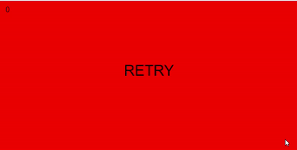

# Gravity
This is a games that plays with gravity and walls to create an entertaining challenge. written in JavasCript using the library P5.js
## Functionality
It works like this: if you click, the gravity is reversed. If you collide with one of the incoming walls, you lose.
## How to run
  * Download the file 
  * Extract it anywhere
  * Open the index.html
  * You should see the game running!
## Video Example

## Future improvements
There should different types of obstacles, or maybe some platforms or score boosters.
